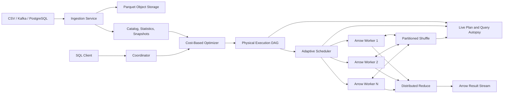

# QueryForge X — Adaptive, Fault-Tolerant Lakehouse Query Engine

## Implementation status

| Phase | Status | Verified evidence |
|---|---|---|
| 1. Correctness and deterministic recovery | **Complete** | 77 unit/property tests; 100/100 seeded queries matched DuckDB; forced worker loss recovered through a numbered second attempt with an unchanged result; late-subscriber replay verified |
| 2. Columnar, bounded-memory execution | **Complete** | Disk-streamed ingestion, dual CSV/Parquet snapshots, catalog statistics, Node/DuckDB and Rust/DataFusion workers, Arrow IPC, bounded backpressure, pruning metrics, reversible routing, 100/100 Rust-only differential queries, and storage ablation are verified |
| 3. Distributed joins and adaptive execution | **Complete** | Costed local/broadcast/hash-shuffle joins, Bloom reduction, persisted feedback, exact hot-key splitting, admission budgets, least-load scheduling, and cancellation-safe speculation are verified. On 240,000 skewed rows adaptive p50 fell 3,748→3,116 ms and the critical task 2,397→1,576 ms; balanced p50 was unchanged at 1,569 ms |
| 4. Approximate analytics | **Complete** | Workers emit one mergeable state per partition for HLL, KLL, count-min heavy hitters, and priority reservoirs; the coordinator persists error/size/latency evidence; the Sketch Lab compares exact and approximate values; the seeded uniform, Zipfian, and adversarial gate passed |
| 5. Chaos and durable control plane | **Complete** | Durable winner constraints, SHA-256 checksums, content-addressed immutable dataset snapshots, five injected-failure modes, actual worker-container termination, coordinator restart replay, and an automated CI failure matrix are implemented and checksum-verified |
| 6. Explainability and evaluation | **Complete** | Physical-plan DAGs, CPU/RSS/row/byte counters, Query Autopsy, all requested ablations, TPC-H-derived workloads, verified 1/2/4/8-worker scaling, and a green one-command JSON/Markdown/SVG report are implemented |

Status is evidence-based: a phase is only marked complete after its exit gate runs successfully.

## Project thesis

QueryForge X is a distributed analytical SQL engine that minimizes bytes scanned and transferred, adapts to runtime skew and worker failures, supports exact and bounded-error approximate analytics, and explains every physical-plan decision with reproducible evidence.

The project is evaluated as a data system, not only as a web application. Every performance claim must include correctness checks, repeatable workloads, resource measurements, and an explicit baseline.

## Success criteria

- Every accepted SQL query returns the same result as the reference engine for the supported SQL subset.
- Unsupported SQL is rejected before any task is scheduled.
- Missing, failed, duplicated, or retried partition attempts cannot silently remove or double-count data.
- Execution remains bounded-memory from ingestion through result delivery.
- Physical optimizations expose measurable reductions in scanned bytes, shuffle bytes, memory, or latency.
- Failure recovery preserves result checksums.
- Approximate functions publish their configured and observed error.
- Benchmarks are repeatable and never report performance without validating results.

## Target architecture

## Phase 1 — Correctness and deterministic recovery

### Deliverables

- Define and enforce a documented SQL compatibility grammar.
- Reject `OR`, joins, subqueries, expressions, multiple statements, and unsupported functions until implemented.
- Bind the SQL `FROM` table to the selected catalog dataset.
- Support global and grouped `COUNT`, `SUM`, `AVG`, `MIN`, and `MAX`.
- Maintain independent aggregate state per output expression.
- Implement SQL-compatible null handling for aggregate inputs.
- Propagate worker failures through gRPC and fail incomplete jobs.
- Replace detached recovery with coordinator-owned attempts.
- Add attempt numbers and winner commits so retries are idempotent.
- Prevent stale or duplicate task results from entering the reduce phase.
- Make progress events represent actual completed partitions.
- Preserve results for late subscribers or establish subscription before execution.
- Add differential tests against DuckDB for every supported query family.
- Add property tests for partitioning and aggregate merges.
- Make Docker Compose reproducible with pinned, available images and lockfiles.

### Exit gate

At least 100 generated datasets and query variants must match DuckDB exactly. Killing any one worker during execution must produce the same result checksum as a failure-free run.

### Rollback

The existing protobuf fields remain readable during the aggregate-state expansion. New fields use unused protobuf numbers, and the coordinator supports legacy partial results during the transition.

## Phase 2 — Columnar, bounded-memory execution

### Implemented evidence

- Every new upload writes rollback CSV and ZSTD-compressed Parquet partitions before atomically committing `storage_format = 'parquet'`.
- File, column, and row-group statistics are stored in the catalog, including null counts, minima, maxima, approximate distinct counts, compressed bytes, and row counts.
- The active worker path uses DuckDB's native vectorized Parquet engine with projection and predicate pushdown, a 256 MB reservation, spill directories, and streamed result chunks.
- Plain columnar results travel as Arrow IPC stream batches over gRPC; legacy row messages remain readable during the migration.
- `PATCH /api/datasets/:id/storage-format` provides a guarded, reversible CSV/Parquet switch and rejects changes while jobs are active.
- Task evidence records scanned rows, scanned/skipped bytes, and peak task-memory deltas.
- On the seeded 100,000-row storage ablation, selective scan bytes fell from 2,127,952 to 4,633 (99.78%), p50 fell from 95 ms to 39 ms, and full-aggregate peak task memory fell from 11,272,192 to 3,538,944 bytes (68.6%).
- Uploads use disk-backed Multer storage, two streaming CSV passes, bounded stringifier buffers, temporary partition files, and file-stream S3 uploads. A 100,000-row production-path run left no temporary files behind.
- The optional `worker-rust` Compose profile provides a self-registering DataFusion 49 worker with signed S3 downloads, a 256 MB fair spill pool, bounded gRPC backpressure, Arrow IPC results, and merge-compatible partial aggregate state.
- With every Node worker stopped, the packaged Rust/DataFusion container matched DuckDB on 100/100 seeded queries under the unchanged protobuf contract.

The native DuckDB worker remains the rollback engine while the Rust/DataFusion worker is independently selectable through the Compose profile.

### Deliverables

- Convert ingested CSV into Parquet row groups.
- Store file and row-group statistics: count, nulls, minimum, maximum, and distinct estimates.
- Move worker execution to Rust with Apache Arrow/DataFusion.
- Exchange Arrow record batches through Arrow Flight or Arrow IPC over gRPC.
- Implement projection, predicate, partition, and row-group pruning.
- Stream batches through filters and aggregates without materializing partitions.
- Add memory reservations, spilling, cancellation, and backpressure.
- Record scanned, skipped, spilled, and transferred bytes per operator.

### Exit gate

Results remain identical to Phase 1. On selective analytical queries, Parquet execution must demonstrate lower scanned bytes and peak memory than the CSV baseline.

### Rollback

Datasets retain their original CSV objects and storage format metadata. The coordinator can route a dataset to the legacy reader until the Parquet snapshot is committed.

## Phase 3 — Distributed joins and adaptive execution

### Implemented evidence

- The byte-cost model selects a coalesced local join for tiny inputs, broadcast for a sufficiently asymmetric build side, and a two-stage hash exchange for balanced large inputs.
- Hash shuffle writes deterministic Parquet buckets to object storage; matching buckets are joined independently and retain atomic partition-winner semantics.
- A mergeable 262,144-bit Bloom filter is built across the smaller input and pushed into probe-side shuffle maps through a vectorized DuckDB scalar filter.
- The same seeded join produced checksum `707bda2c…c459` through both the local and Bloom-filtered hash-shuffle plans. Local execution took 120 ms; forced shuffle took 337 ms and materialized 13,997 bytes, validating the local-versus-distributed choice rather than assuming distribution is always faster.
- Explain output names the selected strategy, reason, build/probe byte estimates, exchange edges, and physical join operator.
- Shuffle maps persist per-bucket row/byte statistics. A bucket above the runtime skew threshold is split by probe-source file while its much smaller build bucket is replicated, preserving exact inner-join semantics and independent logical winner commits.
- Query fingerprints persist exponential moving averages for result cardinality and straggler ratio, the last physical plan, hot-bucket count, and a recommended shuffle width; subsequent plans expose and consume that feedback.
- The seeded 240,000-row skew gate detected one 196,080-row hot bucket and expanded eight buckets into fifteen logical partitions. Across five measured runs, p50 fell from 3,748 to 3,116 ms (16.9%) and median critical-task time from 2,397 to 1,576 ms (34.3%) with checksum `643abca7…21ce9` unchanged.
- Balanced input produced no false hot-bucket classification: static and adaptive p50 were both 1,569 ms, comfortably inside the 25% regression budget.
- Speculative losers are now cancelled at the gRPC boundary and reach a terminal task state before job commit, so completed-job lineage cannot mutate after publication.

### Deliverables

- Broadcast hash join for small build sides.
- Hash-shuffle join for large inputs.
- Bloom-filter semi-join reduction.
- Cost model using row count, byte size, selectivity, and cardinality statistics.
- Runtime cardinality feedback.
- Skew detection and hot-partition splitting.
- Speculative execution for stragglers.
- Local-versus-distributed plan selection.
- Admission control, query priorities, and per-query resource budgets.

### Exit gate

Join results match DuckDB. Adaptive execution must outperform or move fewer bytes than static planning on documented skewed workloads without regressing balanced workloads beyond the allowed threshold.

## Phase 4 — Approximate analytics

### Implemented evidence

- `POST /api/approximate` validates catalog columns and user-selected accuracy parameters, fans out across sketch-capable workers, merges only serialized states, and persists every run in `approximate_runs`.
- The protobuf contract carries `sketch_spec_json` and `sketch_state`; no raw input values cross gRPC for approximate execution.
- HyperLogLog, weighted KLL, count-min heavy hitters, and deterministic priority reservoirs have partition/merge unit coverage.
- The Sketch Lab UI exposes algorithm parameters, exact-reference comparison, configured and observed error, state size, wire bytes, rows scanned, and latency.
- The seeded 60,000-row accuracy gate passed: uniform HLL error 1.085% (1.625% configured), adversarial HLL error 1.162%, KLL p95 rank error 0.085%, exact top-3 Zipfian heavy hitters, and a repeatable 64-row sample.
- The uniform HLL workload transferred 16,524 bytes instead of the 1,753,010-byte raw dataset representation (99.06% reduction).

### Deliverables

- `APPROX_COUNT_DISTINCT` using HyperLogLog or CPC sketches.
- `APPROX_PERCENTILE` using KLL or REQ sketches.
- Heavy hitters using a mergeable frequency sketch.
- Reservoir sampling for interactive previews.
- User-selectable accuracy or memory parameters.
- Mergeable protobuf/Arrow sketch representation.
- Exact-versus-approximate comparison in the UI.
- Observed error, configured bound, state size, and latency reporting.

### Exit gate

Accuracy experiments cover uniform, Zipfian, and adversarial distributions. Reported bounds and observed errors must be reproducible from seeded datasets.

## Phase 5 — Chaos engineering and durable control plane

### Implemented evidence

- Five deterministic injected modes preserve the failure-free checksum: delay, network loss, corrupted input, duplicate work, and skew.
- A real `docker compose stop -t 0 worker-1` test produced one failed attempt, four total attempts, and the unchanged baseline checksum.
- Coordinator restart recovery durably abandons pre-start attempts and replays under the same job ID; its startup cutoff prevents active post-start jobs from being mistaken for interrupted work.
- Dataset IDs are immutable snapshot IDs. New uploads persist the SHA-256 source checksum, snapshot version, generator configuration, and immutable object paths; jobs retain the snapshot foreign key.
- `.github/workflows/verification.yml` runs unit/build gates plus differential, chaos, worker-crash, and coordinator-restart validation and preserves container logs as an artifact.

### Deliverables

- Chaos controls for worker crash, delay, network loss, corrupted input, duplicates, and skew.
- Durable job state and coordinator restart recovery.
- Lease-based attempts and atomic winner commits.
- Result checksums and lineage records.
- Dataset snapshots and reproducible historical queries.
- Automated failure matrix in CI.

### Exit gate

Each injected failure has an expected terminal state. Recoverable failures preserve the baseline checksum; unrecoverable failures report the exact missing or corrupted input and never return partial success.

## Phase 6 — Explainability and experimental evaluation

### Implemented evidence

- `GET /api/query/jobs/:id/autopsy` attributes the critical path, straggler ratio, failures/retries, scanned and transferred bytes, spill, peak task memory, and mean cardinality error, then emits evidence-based optimization suggestions.
- The React Query Autopsy renders the worker-attempt timeline and optimizer notes after every completed query; the Sketch Lab renders configured-versus-observed approximation error.
- `npm run verify-all` in `benchmarks/` runs correctness, storage, join, approximation, chaos, worker-crash, and coordinator-restart suites and emits machine-readable JSON, Markdown, and an SVG chart under `benchmarks/artifacts/`.
- The matrix also provisions five elastic containers beside the three fixed workers, uploads an eight-partition 600,000-row dataset, and runs one warm-up plus five measured repetitions at 1, 2, 4, and 8 workers while requiring invariant result checksums and actual use of the requested worker count.
- On the TPC-H-derived Q1 grouped scan, p50/p95 moved from 87/96 ms at one worker to 61/77 ms at eight (1.43× p50 speedup). The Q6-derived selective workload moved from 73/98 ms to 56/66 ms (1.30×). Reports include parallel efficiency, task CPU time, peak RSS, scanned bytes, and transferred bytes rather than hiding coordination overhead.
- The final storage/vectorization gate measured 111 ms row-CSV versus 39 ms vectorized Parquet p50. Row-group pruning skipped 144,430 of 149,063 Parquet bytes, and worker partial aggregation reduced transfer from 240,868 to 3,266 bytes (98.64%).
- Scheduling is ablated through the 1/2/4/8 worker study; skew through static-versus-adaptive plans; failure through five injected modes plus real container and coordinator loss; and approximation through exact-versus-sketch accuracy/transfer comparisons.
- The final unified invocation passed nine suites: DuckDB differential, storage, join, approximation, scaling, adaptive skew, chaos, worker crash, and coordinator restart. The worker crash preserved checksum `d46abbd4…a9a55`; SIGKILL restart recovery abandoned six in-flight attempts and committed checksum `d916efca…ec64`.

### Deliverables

- Live physical-plan DAG with operator state and critical path.
- Per-edge row and byte counters.
- Estimated-versus-actual cardinalities.
- Worker CPU, memory, spill, throughput, and retry timelines.
- Query Autopsy with bottleneck attribution and optimization suggestions.
- TPC-H-derived benchmark runner with correctness comparison.
- Ablations for storage, vectorization, pruning, partial aggregation, scheduling, skew, failure, and approximation.
- Scaling experiments across 1, 2, 4, and 8 workers.
- p50/p95 latency, peak RSS, scanned bytes, shuffle bytes, recovery overhead, and parallel-efficiency reports.

### Exit gate

One command produces the datasets, runs the benchmark matrix, validates result checksums, and emits machine-readable JSON plus the final report charts.

---

## Milestone 2 — Course-native execution, lineage, streaming, and presentation

Milestone 1 remains the verified batch-engine baseline above. Milestone 2 adds the
MapReduce, Spark, and Data Streams concepts from CS404 without weakening the
existing correctness or failure gates. A feature is marked complete only after
its focused gate and the complete Milestone 1 regression matrix both pass.

| Phase | Implementation status | Required proof |
|---|---|---|
| 2.5 MapReduce refinement | **Implemented; focused gate passed** | Three combiner ablations, partition-skew explorer, cost equations, p99 speculation experiment |
| 6.5 Spark-style abstractions | **Implemented; focused gate passed** | Durable partition lineage, lazy actions, bounded cache levels, pinned broadcasts, exactly-once accumulators |
| 7 Query Autopsy & Cost Analyzer | **Implemented; focused gate passed** | Top operators, cost attribution, measured what-if replay, workload regression replay |
| 8 Streaming SQL | **Implemented; enhanced gate awaiting matrix rerun** | Kafka-compatible source, windows/watermarks, durable offsets/state, zero committed-batch loss, materialization |
| 9 Educational presentation | **Implemented; focused gate passed** | One-command crash demo, course tooltips, lineage/ablation views, quiz and accessible walkthrough |

The earlier focused runs are preserved in
`benchmarks/artifacts/milestone2-report.json`. The status wording above does not
claim final acceptance: every phase becomes **Complete** only when the enhanced
13-suite matrix regenerates that artifact with
`verificationState: full-matrix-passed`.

### Milestone 2 acceptance and scope boundaries

- Partition overrides are restricted to catalog-bound columns and validated
  bucket counts; arbitrary executable expressions are not accepted.
- Lineage is recorded at dataset, operator, and partition granularity. Sampled
  row provenance may be displayed, but full cell-level provenance is not part of
  the recovery contract.
- Spark terminology is educational vocabulary over QueryForge's Arrow/gRPC
  runtime, not a claim of Spark API compatibility.
- Streaming commits input offsets and window state atomically. Killing a worker
  may replay an uncommitted micro-batch but cannot lose a committed one.
- Official benchmark claims continue to use seeded inputs, reference results,
  warm-ups, at least five measured repetitions, and machine-readable artifacts.

## Phase 2.5 — MapReduce refinement pass

**Course mapping:** Map, combiner, partition function, shuffle/reduce,
communication cost, and backup tasks.

### Deliverables

- Make mapper-side combiners an explicit plan operator. `AVG` transports
  `(sum,count)`; all combiners are gated by merge-safe aggregate semantics.
- Provide a controlled no-combiner execution mode for evidence, never as an
  implicit production fallback.
- Add a partition explorer for `hash(catalog_column) mod bucket_count`, reporting
  bucket rows, bytes, coefficient of variation, and detected hot buckets.
- Expose actual input, shuffle, output, CPU, and critical-path costs in
  `EXPLAIN`; display the teaching equations beside measured values.
- Base speculative execution on observed sibling progress/duration, cancel the
  loser, and commit exactly one logical-partition winner.

### Exit gate

Three aggregate workloads preserve their checksums while mapper combiners reduce
wire bytes. A seeded straggler study reports p50/p95/p99 and shows a lower p99
with speculation. The partition explorer identifies both balanced and skewed
fixtures correctly.

## Phase 6.5 — Spark-style abstractions

**Course mapping:** lineage, lazy transformations/actions, persistence,
broadcast variables, and accumulators.

### Deliverables

- Persist a lineage DAG for every dataset and executed operator, including
  parent nodes, transformation, partition layout, content hash, and replay data.
- Add a lazy plan API returning a `planId`; `collect`, `count`, `write`, and
  `materialize` are explicit actions.
- Implement bounded `MEMORY`, `DISK`, and `MEMORY_AND_DISK` worker caches with
  LRU eviction, pinning, hit/miss/eviction counters, and query memory budgets.
- Pin broadcast-build objects once per worker and reuse them across join tasks.
- Commit task accumulators only with the logical winner so retries cannot
  double-count `rows_scanned`, `rows_passed_filter`, or `bytes_shuffled_total`.
- Rebuild a missing derived partition by replaying lineage from the nearest
  valid cached/materialized ancestor.

### Exit gate

Planning p95 stays below 50 ms. Killing a worker and deleting one derived
partition triggers lineage replay, preserves the checksum, and records the
ancestor/replay path. Cache-level tests prove bounds and eviction. Accumulators
match task truth in retry and speculation runs.

## Phase 7 — Query Autopsy & Cost Analyzer

### Deliverables

- Highlight the critical path and top three operators by wall time, including
  scanned/produced rows, CPU, RSS, spill, wire bytes, and throughput.
- Attribute measured cost to computation, communication, storage, waiting, and
  recovery; never infer unavailable measurements as facts.
- Produce evidence-backed suggestions with the exact triggering metric.
- Provide a one-click what-if run using a validated alternate plan and show the
  checksum, latency, bytes, CPU, and memory delta.
- Record named workloads as SQL, parameters, dataset snapshots, and plan
  controls; replay them against the current build for regression detection.

### Exit gate

Five canonical queries have an asserted dominant-cost classification. Every
suggested what-if preserves the checksum; suggestions claimed as improvements
must demonstrate an actual measured improvement.

## Phase 8 — Streaming SQL mode

**Course mapping:** standing queries, sketches, watermarks, tumbling/hopping/
session windows, late data, and stream-to-batch materialization.

### Deliverables

- Add a Kafka-compatible source and durable standing-query registry.
- Support validated `REGISTER QUERY`/`UNREGISTER` operations and `TUMBLE`, `HOP`,
  and `SESSION` window specifications for the documented streaming subset.
- Process bounded micro-partitions through workers and commit source offsets,
  window state, accumulator deltas, and output epochs idempotently.
- Track event-time watermarks, configured allowed lateness, accepted late rows,
  and rows routed to the late-event audit stream.
- Publish live exact and sketch aggregates to the UI with configured and
  observed HLL/CMS error.
- Materialize a consistent output epoch into an immutable Parquet dataset whose
  lineage points to the standing query and source offsets.

### Exit gate

A deterministic Kafka fixture drives all three window types. Restart and worker
failure tests show zero loss or duplication of committed micro-batches. A live
HLL dashboard updates at least once per second with configured relative error
below 1%, and materialized output matches the reference window computation.

## Phase 9 — Educational demo and presentation mode

### Deliverables

- `npm run demo:survive-crash` provisions a fixture, starts a query, synchronizes
  on a running attempt, terminates Worker 2, and verifies recovery/checksum in
  under 60 seconds on the reference machine.
- Add accessible course-reference tooltips to physical operators.
- Add a pan/zoom partition-lineage explorer with replay status and optional
  sampled row provenance.
- Add a side-by-side ablation view backed only by verified report artifacts.
- Add course quiz cards for MapReduce, Spark-style lineage, and streaming, with
  deterministic answer checks and explanations.
- Add a dismissible, keyboard-accessible 60-second first-run walkthrough and a
  one-page presentation guide.

### Exit gate

The scripted demo passes from a clean Compose deployment. A keyboard-only user
can complete the walkthrough and quiz, inspect lineage, and understand the three
course mappings without reading repository source.

## Recommended ownership boundaries

- **Node.js coordinator:** API, catalog, logical planning, scheduling, attempts, job state, WebSocket control plane.
- **Rust workers:** Parquet/Arrow scan, vectorized operators, joins, aggregation, spilling, sketch computation.
- **PostgreSQL:** durable metadata, attempts, snapshots, lineage, benchmark runs.
- **Object storage:** immutable data files, shuffle objects where required, result artifacts.
- **React UI:** SQL workspace, live DAG, chaos controls, query autopsy, benchmark explorer.
- **Prometheus/OpenTelemetry:** metrics and traces with an actual trace exporter and backend.

## Benchmark rules

- Validate output before recording a timing.
- Use seeded data generation and persist generator configuration.
- Separate cold-cache and warm-cache results.
- Report at least five measured repetitions after warm-up.
- Record hardware, container limits, engine commit, dataset snapshot, and worker count.
- Compare against the previous QueryForge phase and a reference analytical engine.
- Describe workloads as TPC-H-derived unless the official compliance rules are followed.

## Milestone 2 compatibility and rollback

- Protobuf additions use new field numbers; legacy task/result fields remain
  readable. A prior coordinator can continue using the batch RPC while the new
  stream RPC remains unused.
- Migrations 013–018 are additive, transactional, and idempotent. They retain
  all existing jobs, datasets, tasks, and results; rollback means deploying the
  prior application version and leaving the new tables/columns dormant.
- CSV objects and the Node/DuckDB worker remain available as storage and compute
  rollback paths. Cache level `NONE` and combiner/speculation controls provide
  explicit runtime baselines.
- Kafka offsets are committed only after PostgreSQL state commits. A restart may
  replay input, while the durable offset filter prevents a second state update.
- No destructive schema contraction or historical-data rewrite is part of this
  milestone.

## Explicit non-goals until the core gates pass

- Natural-language-to-SQL or chatbot features.
- Authentication and billing polish.
- Broad SQL syntax without execution tests.
- Kubernetes deployment before local failure semantics are correct.
- Claims of production readiness or benchmark superiority without reproducible evidence.
